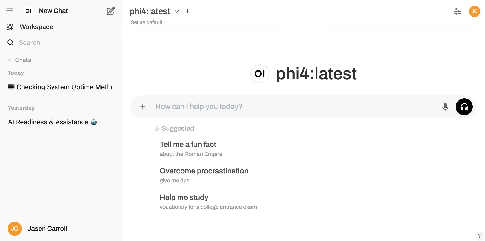

# Self-Hosted Language Models: Building a Bare Metal AI Development Environment



## Overview
This project provides a self-hosted environment for language model experimentation, eliminating dependencies on external APIs. Built around Open WebUI and secured with Tailscale, it offers developers complete control over their AI tools while maintaining security and privacy through a bare metal approach.

## Architecture

### Frontend Architecture
- **UI Framework**: Open WebUI for intuitive language model interaction
- **Interface**: Modern, responsive design for seamless user experience
- **Real-time Updates**: WebSocket communication for instant model responses
- **Customization**: Configurable UI settings for personalized experience
- **Prompt Management**: System for saving and organizing prompts

### Backend Architecture
- **Core**: Open WebUI server for handling model interactions
- **Security**: Tailscale for encrypted networking and access control
- **Models**: Support for multiple language models with easy switching
- **Compute**: Optimized inference with CPU and optional GPU acceleration
- **Storage**: Local file system for model weights and configurations
- **OS**: Bare metal Ubuntu Server for direct hardware access and performance optimization

## Technologies Used
- **Frontend**: 
  - Open WebUI for user interface
  - React-based components
  - WebSocket for real-time communication
- **Backend**: 
  - Python backend services
  - Model serving frameworks
  - Bare Metal Ubuntu
- **Security**: 
  - Tailscale for zero-config VPN
  - End-to-end encryption
  - Private network isolation
- **AI Models**: 
  - Support for multiple small language models
  - Inference optimization techniques
- **DevOps**:
  - Nginx reverse proxies
  - Prometheus, htop, nvidia-smi, etc.
  - Systemd process automation.
  - Cronjobs for automatic backups.

## Features
- **Language Model Integration**: 
  - Support for various open-source models
  - Easy model switching and configuration
  - Context length management
- **Security Controls**: 
  - Tailscale-protected access
  - Private network deployment
  - No data sent to external APIs
- **User Experience**: 
  - Intuitive chat interface
  - Conversation management
  - Prompt templates and history
- **Performance**: 
  - Optimized inference for bare metal hardware
  - Resource monitoring and fine-tuning
  - Response streaming with minimal latency
- **Customization**: 
  - Model parameter adjustments
  - Temperature and sampling controls
  - System prompt configuration

## Development Process

### Motivation and Evolution
This project was motivated by several key factors:
- Growing concerns about data privacy when using commercial AI APIs
- Need for experimentation without usage limitations or costs
- Desire for complete control over model selection and configuration
- Recognition that many developers want AI capabilities without external dependencies

### Architecture Decisions
- **Open WebUI over Custom UI**: Leveraged existing open-source UI to accelerate development
- **Tailscale for Security**: Chose Tailscale for its simplicity and strong security model
- **Bare Metal over Containerization**: Selected for maximum performance, direct hardware access, and simplified resource management
- **Local Model Execution**: Prioritized on-device inference over API calls for privacy and control
- **Modular Design**: Structured for future integration of advanced tools like LangChain and LlamaIndex

### Workflow
1. Ubuntu installation with adequate hardware and something similar to a GTX-3080.
2. Open WebUI installation and configuration
3. Integration with Tailscale for secure networking
4. Model download and optimization procedures
5. System testing and performance tuning
6. Documentation creation for deployment and usage

### Key Advantages
- Complete independence from commercial AI providers
- Enhanced privacy and data security
- No usage limits or unexpected costs
- Full control over model selection and parameters
- Ability to run offline without internet connectivity

## Implementation Details

### Bare Metal Configuration

Skipping Docker and going straight for bare metal because, we want the AI to have more access to the
environment and be able to pull resources as needed. For this we'll use an Intel 12th generation i5
desktop CPU in a custom build with 64 GB of RAM and an Nvidia GTX-3080 with 10 GB of VRAM.

- Installed Ollama for running inference locally.
- Downloaded the Phi4 model from Microsoft for open source.
- Installed Open WebUI using a virtualenv and pip
- Hardened the server, until it didn't make any more sense to continue.
- Removed some of the hardening for the app to breathe/function correctly.
- Integrated Tailscale

### Tailscale Integration

Integrating Tailscale was as easy as installing it. All you have to do is point the Nginx reverse
proxy to the IP address that Tailscale provides. This ensures that only devices logged in to your
Tailscale have access to your application, basically a free VPS as I understand it.

## Deployment

The deployment process follows these key steps on a bare metal Ubuntu server:

```bash
# Update system packages
sudo apt update && sudo apt upgrade -y

# Install required dependencies
sudo apt install -y python3-pip python3-venv git nginx

# Install Ollama
curl -fsSL https://ollama.com/install.sh | sh

# Install CUDA drivers (if using NVIDIA GPU)
sudo apt install -y nvidia-driver-535 nvidia-cuda-toolkit

# Clone Open WebUI repository
git clone https://github.com/open-webui/open-webui.git
cd open-webui

# Setup Python virtual environment
python3 -m venv venv
source venv/bin/activate
pip install -r requirements.txt

# Install Tailscale
curl -fsSL https://tailscale.com/install.sh | sh

# Configure Tailscale
sudo tailscale up

# Configure Nginx as reverse proxy
sudo cat > /etc/nginx/sites-available/open-webui << EOF
server {
    listen 80;
    server_name _;

    location / {
        proxy_pass http://localhost:8080;
        proxy_set_header Host \$host;
        proxy_set_header X-Real-IP \$remote_addr;
        proxy_set_header X-Forwarded-For \$proxy_add_x_forwarded_for;
        proxy_set_header X-Forwarded-Proto \$scheme;
    }
}
EOF

# Enable site configuration
sudo ln -s /etc/nginx/sites-available/open-webui /etc/nginx/sites-enabled/
sudo nginx -t
sudo systemctl restart nginx

# Create systemd service for Open WebUI
sudo cat > /etc/systemd/system/open-webui.service << EOF
[Unit]
Description=Open WebUI Service
After=network.target ollama.service

[Service]
User=$(whoami)
WorkingDirectory=$(pwd)
Environment="PATH=$(pwd)/venv/bin"
Environment="OLLAMA_API_BASE_URL=http://localhost:11434/api"
Environment="WEBUI_AUTH=true"
Environment="WEBUI_INTERNET_FACING=false"
ExecStart=$(pwd)/venv/bin/python -m app.backend.main

[Install]
WantedBy=multi-user.target
EOF

# Enable and start the service
sudo systemctl daemon-reload
sudo systemctl enable open-webui
sudo systemctl start open-webui

# Download a model through Ollama
ollama pull phi-latest
```

This deployment approach ensures:
- Direct access to system hardware for maximum performance
- Proper system service management through systemd
- Secure networking through Tailscale integration
- Automatic startup on system boot

## Lessons Learned

Throughout this project, I gained valuable insights:
- **Resource Management**: Balancing model size with hardware capabilities is crucial
- **Security Layers**: Multiple security layers provide better protection than a single approach
- **Bare Metal Optimization**: Direct hardware access enables significant performance gains over containerization
- **Model Selection**: Smaller models can provide impressive results with the right configuration
- **User Experience**: The importance of intuitive interfaces for AI interaction
- **System Integration**: Systemd service management simplifies running components as background services

## Future Improvements

Planned enhancements include:
- Integration with LangChain for advanced AI workflows
- Addition of LlamaIndex for document-based queries
- FastAPI backend for custom API development
- Data persistence layer for chat history and user preferences
- Fine-tuning capabilities for model customization